# Monitor operational data captured in an OSIsoft PI data historian with Maximo Asset Monitor
Integrate PLC data from an OSIsoft PI Data Historian with Maximo Asset Monitor using IBM App Connect

## Introduction
A connected and instrument world of the internet of things, devices such as temperature, pressure or flow sensors and actuators are the key source of intelligence and automation in instrumented industrial and manufacturing processes. In many scenarios, Programmable Logic Controller (PLC) and Remote Terminal Unit (RTU) systems typically have direct control over these devices and are able to monitor and control their state. Supervisory control and data acquisition (SCADA) is a device monitoring and controlling framework comprising of instrumented equipment and process, PLC systems, higher level supervisory control computers and often a data historian. The historian is typically a database that captures site and equipment data along with instrumented time series sensor data. The data elements or attributes that are captured are tags or points that correspond to sensors that are often associated with asset site and location.  

The PI System developed by OSIsoft is one such data historian that can capture, store and manage, real-time time series sensor and plant information data from PLC and SCADA systems. A typical PI System configuration consists of systems that are running the PI Interface and collect data, the PI Data Archive server used for efficient storage and retrieval of data, the PI Asset Framework architecture that provides a human consumable mapping of data points to assets or an asset hierarchy and analytic and visualization tools. In addition to the access and view of equipment tag point data, site operators and equipment maintenance professionals need visibility into the operations of their sites, equipment and their health through customizable dashboards, and alerted when anomalies are detected their operation.  

IBM Maximo Asset Monitor is a solution that is powered by AI and provides remote asset monitoring capabilities through monitoring dashboards. With Maximo Asset Monitor you can connect devices, collect metrics and display them on dashboards, transform / cleanse data and detect anomalies. The advanced analytics and AI powered anomaly detection capabilities can be leveraged to detect issues in operational point data that was captured the historian. The tight integration with Maximo Asset Management drives creation of work orders for instrument equipment records maintained in Maximo.

In this code pattern, we will monitor simulated Oil Well drilling equipment data in Maximo Asset Monitor by integrating an OSIsoft PI System data Historian with it using IBM App Connect Enterprise. For the purpose of this code pattern we have used a simple OSIsoft PI System configuration and used an Asset Based PI Example kit to generate simulated data. Data from the PI data historian is connected to Maximo Asset Monitor through a configuration flow in App Connect Enterprise that maps data from the PI data historian to tables in Maximo Asset Monitor.

When you have completed this code pattern, you will understand how to:

* Monitor operational data in a data historian in Maximo Asset Monitor and create dashboards and alerts.
* Query an OSIsoft PI data historian to fetch operational time series point data.
* Integrate operational data from the PI data historian with Maximo Asset Monitor using IBM App Connect Enterprise.

<!--add an image in this path-->
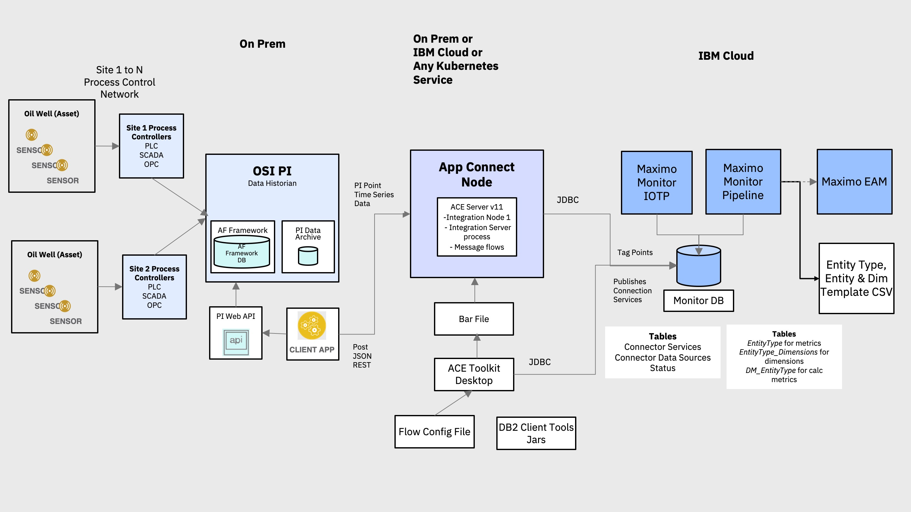

<!--Optionally, add flow steps based on the architecture diagram-->
## Flow

1. The PI System collects operational asset time series sensor data  as PI points via a PI Interface which gets persisted in a PI archive.
2. A scheduled cron script fetches new point data from the archive or data historian using PI Web APIs, filters and formats the data and sends it to App Connect via a HTTP POST.
3. In App Connect, point data is mapped to data in the entity type and dimensions tables that was created to store point data and point meta-data.
4. Point data captured in these tables for each site and asset can be viewed in Maximo Asset Monitor and dashboards created for a consolidated view.  


<!--Optionally, update this section when the video is created-->

# Included Components and Technologies

* [IBM Maximo Asset Monitor](https://www.ibm.com/products/ibm-maximo-asset-performance-management/asset-monitor) "Advanced  AI-powered remote asset monitoring at enterprise scale for assets and operations. Essential insights for intelligent asset maintenance and operations."
* [IBM App Connect Enterprise V11](https://www.ibm.com/us-en/cloud/app-connect) "combines the existing, industry-trusted technologies of IBM Integration Bus with IBM App Connect Professional and with new cloud native technologies, to deliver a platform that supports the full breadth of integration needs across a modern digital enterprise."
* [Node.js](https://nodejs.org/) is an open source, cross-platform JavaScript run-time environment that executes server-side JavaScript code.
* [OSIsoft PI Server](https://www.OSIsoft.com/pi-system/pi-capabilities/pi-server/) a data historian server that captures and stores operation point or tag data.  

# Steps

1. [Clone the repo](#1-clone-the-repo).
2. [Setup the OSIsoft PI Server](#2-setup-the-OSIsoft-pi-server).
3. [Prepare Maximo Asset Monitor to receive PI point data](#3-prepare-maximo-asset-monitor-to-receive-pi-point-data).
4. [Install the App Connect Enterprise Developer Edition Toolkit](#4-install-the-app-connect-enterprise-developer-edition-toolkit).
5. [Setup and start an App Connect Enterprise container](#5-setup-and-start-an-app-connect-enterprise-container).
6. [Update the App Connect application configuration and deploy to an ACE server](#6-update-the-app-connect-application-configuration-and-deploy-to-an-ace-server).
7. [Send oil well down time data from the PI data historian to Maximo Asset Monitor](#7-send-oil-well-down-time-data-from-the-pi-data-historian-to-maximo-asset-monitor).
8. [View oil well down time data in Maximo Asset Monitor](#8-view-oil-well-down-time-data-in-maximo-asset-monitor).
9. [Create a dashboard to monitor oil well operations in Maximo Asset Monitor](#9-create-a-dashboard-to-monitor-oil-well-operations-in-maximo-asset-monitor).  

### 1. Clone the repo

Clone the `maximo-monitor-osipi-integration` in the destination of your choice. In a terminal, run:

```
git clone https://github.com/IBM/maximo-monitor-osipi-integration.git
```

### 2. Setup the OSIsoft PI Server

You will need to have an environment with the OSIsoft PI Server and dependent components like a MS SQL Enterprise database management system installed. For this code pattern a simple [PI Server deployment](https://livelibrary.OSIsoft.com/LiveLibrary/web/pub.xql?c=t&action=home&pub=server-v14&lang=en#addHistory=true&filename=GUID-FC32B910-AD95-40B3-87E0-790D4EA0F7FF.xml&docid=GUID-541BD702-45B5-4B3A-8D4B-73776F60A6B5&inner_id=&tid=&query=&scope=&resource=&toc=false&eventType=lcContent.loadDocGUID-541BD702-45B5-4B3A-8D4B-73776F60A6B5) with all PI Server components installed on the same physical Windows machine is sufficient. You will need to install the following [PI Server](https://livelibrary.OSIsoft.com/LiveLibrary/web/pub.xql?c=t&action=home&pub=server-v14&lang=en) components by using the installers and following the default install prompts (remember to point to the MS SQL database):

 * OSIsoft Prerequisites Kit - Standalone version
 * PI Interface Configuration Utility (ICU) Install Kit
 * PI Server 2018 SP3 Patch 1 Installation Kit
 * PI SDK 2018 SP1 Patch 1
 * PI System Management Tools (PI SMT) Installation Kit 2018 SP3 Patch 1
 * [PI SQL Data Access Server via PI Asset Framework (AF) Client 2018 SP3 Patch 2](https://livelibrary.OSIsoft.com/LiveLibrary/web/pub.xql?action=publist_home&_ga=2.262148874.767846259.1592060213-894486930.1585751141&pub_category=PI-SQL-Data-Access-Server-(PI-Integrators))
 * [PI Web API](https://livelibrary.OSIsoft.com/LiveLibrary/web/pub.xql?c=t&action=home&pub=web-api-v13&lang=en)

* For the purpose of this code pattern we will be using simulated oil well drilling equipment downtime data. OSIsoft provides an asset-based example starter kit with simulated data that you will need to install. Download the kit [here](https://pisquare.OSIsoft.com/community/all-things-pi/af-library/asset-based-pi-example-kits/well-downtime-kit) and following the install instructions in the included install guide.  

* Install Node v8.x or greater and npm v5.x or greater. This is needed by the OSIsoft PI Web API client that fetches periodic point data which is then sent to Maximo Asset Monitor via App Connect.  

### 3. Prepare Maximo Asset Monitor to receive PI point data

Maximo Asset Monitor is used to create dashboards that allow you to remotely monitor the performance of your assets. As asset data is received by Monitor, functions can automatically process the data to detect anomalies, generate alerts, and create Work Orders. Follow the steps for setting up your local development environment for Maximo Asset Monitor

* Create a credentials json file in the `scripts` folder named `monitor-demo-credentials.json`. You can find your Monitor credentials on the `Services` tab in your instance of Maximo Asset Monitor.

* Create your Points Entity Type that will have the metrics that are ingested from OSI Pi in to Monitor. This script expects the entity name, and a CSV file containing the metrics.

<!-- python ~/source/scripts/create_points_entities.py -->

```
python ./maximo-asset-monitor/db-scripts/create_entity.py <entity_name> <csv_file>
```

* Create your Data Sources Entity Type that will have the the database connection details for the OSI Pi Historian and provide you a way to monitor data ingestion frequency and if the connector is working.  

Create the Datasource entity type using:
```
python ~/source/scripts/create_datasource_entities.py
```

* From the same `Service` tab, launch "Db2 Warehouse on Cloud" services on the Services tab. Check to see if you scripts have created the tables for your `Points` and `Datasources` Entity Types. Each entity type should also have metric and dimension tables in the Maximo Asset Monitor database to capture the PI historian points.  

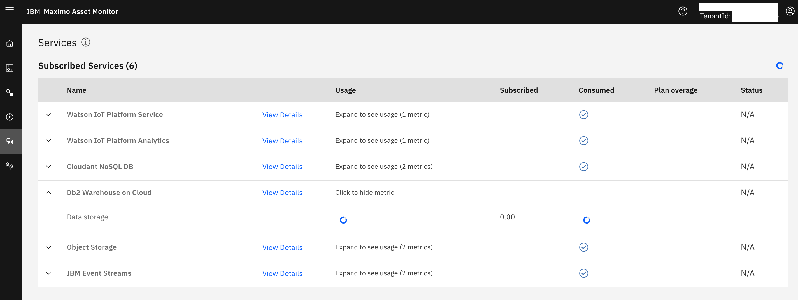

* Download the DB2 JDBC Jar files from the `Connection` menu option in DB2 Warehouse Web UI.  

* Click on the Details and note down the JDBC URL property, user id and password.  This will be needed later when configuring your `BluDB.policyxml` and `USERS.policyxml` file in App Connect to connect to the Maximo Asset Monitor database.

The App Connect service using the message flow included in this pattern and the DB2 JDBC drivers you download onto the host running App Connect will be used to publish data into the Monitor Database.


### 4. Install the App Connect Enterprise Developer Edition Toolkit

App Connect Enterprise is used to ingest data from the OSIsoft PI data historian to Maximo Asset Monitor. The source code in the ace-pi-monitor-integration directory of the cloned GitHub repository defines a flow and a data mapping to achieve this goal. The input node to the flow is a HTTP POST node that accepts a JSON data object. An OSIsoft Web API REST client periodically fetches new point data from PI and sends this point data as JSON to App Connect by calling a POST REST API call. This data is then mapped to columns of the 3 newly created tables in the Maximo Asset Monitor. The output node of the flow is a JDBC connection to insert data in the EntityType, DM_EntityType and EntityType_Dimensions Maximo Asset Monitor tables.  

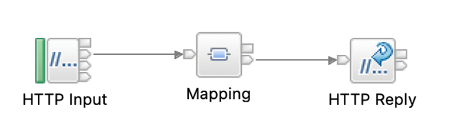

Download and install the IBM App Connect Enterprise for Developers for Windows, MacOS or Linux from [here](https://www.ibm.com/account/reg/signup?formid=urx-32125)

### 5. Setup and start an App Connect Enterprise container

The messaging flow and mapping created and packaged by the toolkit will need to be deployed to a runtime instance of App Connect Enterprise. Connect your App Connect Enterprise (ACE) Developer edition toolkit to an on-premise instance or App Connect, to [App Connect on IBM Cloud](https://www.ibm.com/support/knowledgecenter/en/SSTTDS_11.0.0/com.ibm.ace.cloud.doc/index.html) or an App Connect Docker container. An App Connect Enterprise server container running on  the IBM Cloud Kubernetes service has been used in this code pattern.

* Login to or create a new [IBM Cloud Lite (free tier)](https://cloud.ibm.com/login) account if you do not already have one.

* Search for and provision an instance of the [IBM Cloud Kubernetes service](https://cloud.ibm.com/catalog?category=containers#services) from the IBM Cloud service catalog.

 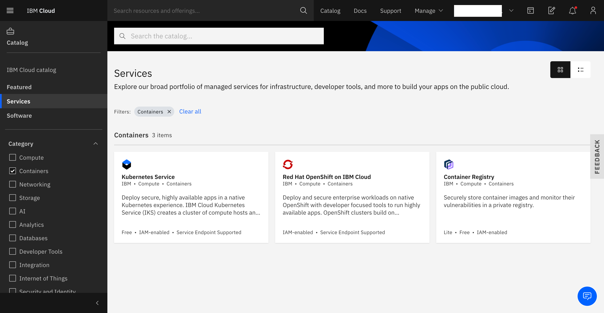

* Your cluster could take up to 45 minutes to provision. Once it has provisioned, note down the Cluster ID of your Kubernetes cluster and the public IP address of the worker node.

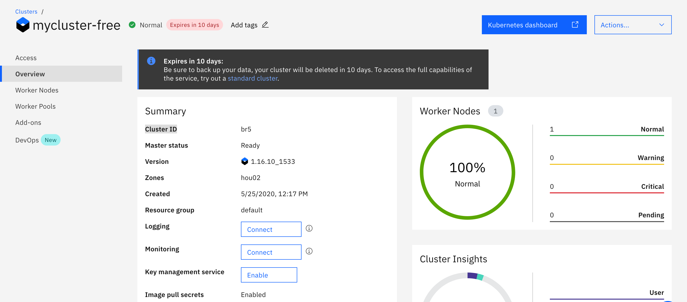

 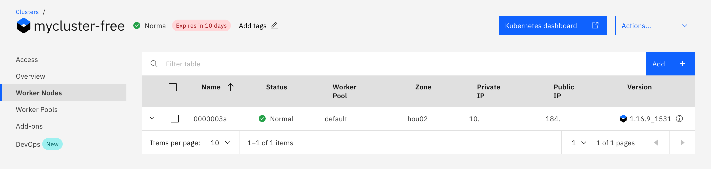

* [Setup the IBM Cloud Command Line tools and Kubernetes service plugins](https://cloud.ibm.com/docs/containers?topic=containers-cs_cli_install)

* Validate that you can connect to your cluster
```
ibmcloud login -a cloud.ibm.com -r us-south -g default  
ibmcloud ks cluster config --cluster <cluster id>   
kubectl config current-context  
```

* Deploy an instance of the App Connect container by running the following command from the root directory of this project:
```
kubectl create -f ./ace-pi-monitor-integration/ace/kube-config.yml
```

* Once the ACE container has been deployed, you can open your ACE server by navigating to the public IP of your Kubernetes cluster and the port assigned in the Kubernetes configuration file ex. http://184.x.x.x:30007/?tab=0  (the ACE container instance has not been password protected)

 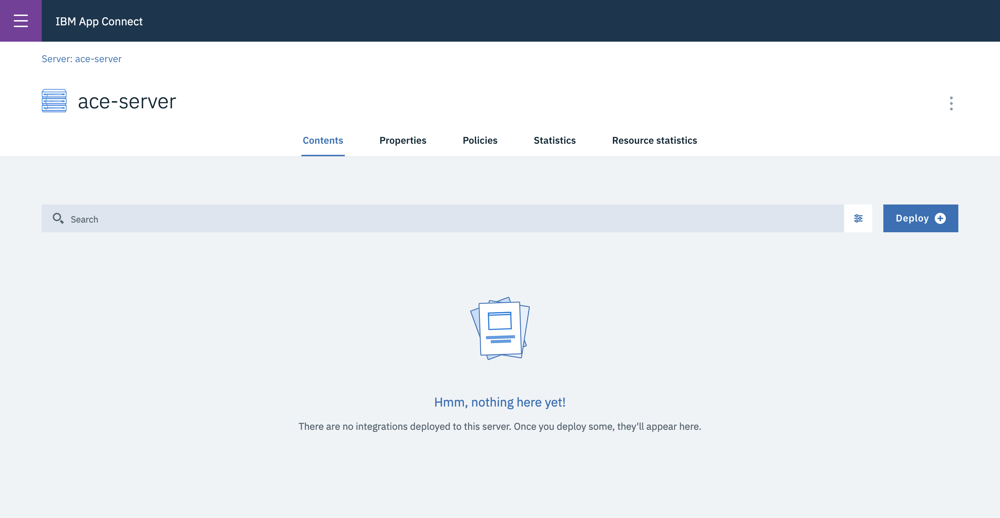

### 6. Start by learning how to use message flows using the App Connect Database Mapping tutorial

Get a basic message flow working to create an employee table. The tutorial included with App Connect Toolkit, has you create an employees database, which the App Connect Enterprise message flows will send a Json payload message to. Use the DB2 service provided in Maximo Monitor, and credentials you noted earlier to access the database. The DB userid will need to have administrative privileges.

##### Create a new example database for this tutorial named "USERS"

<!-- Start a DB2 Command Window
In Mac it is a menu option on the App Connect Toolkit app menu.
 -->
Create table in SQL editor in DB2 Cloud.

Execute the following command to create a "Users" table

```
db2 create database USERS
```

Connect to the database which was just created, and create a table into which the message flow will insert data. From the same window, start an interactive command session by typing db2 and then execute the following commands

```
CONNECT TO USERS

CREATE TABLE MYSCHEMA.EMPLOYEES (PKEY INTEGER NOT NULL, FIRSTNAME VARCHAR(30), LASTNAME VARCHAR(30), COUNTRY VARCHAR(2), PRIMARY KEY(PKEY))
```

- Create an integration node, set up your credentials, define a default policy project and then deploy by completing the following steps:

<!-- * Start an App Connect Enterprise command console in Mac it it is on the top left menu option.   `~your-user-id/IBM/ACET11/workspaceMonitor/` -->
- Start an App Connect Enterprise command console
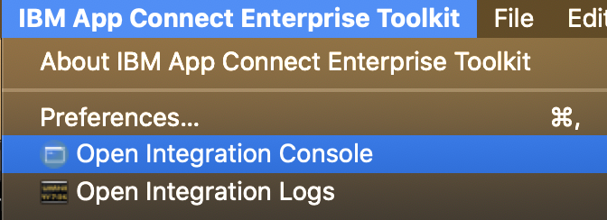

You should then see the following screen
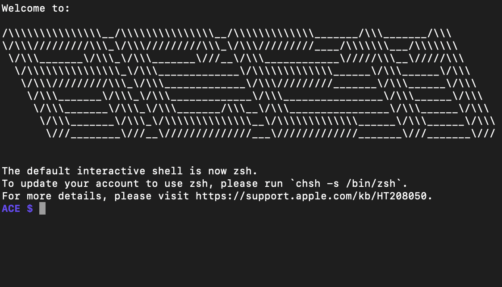


<!-- * In `MyPolicies / Policy / USERS.policy.xml` Leave Security `DSN` `mydbidentity` -->

Execute the following commands in the console:

```
mqsicreatebroker TESTNODE
mqsistart TESTNODE
mqsicreateexecutiongroup TESTNODE -e server
mqsistop TESTNODE
mqsisetdbparms TESTNODE -n jdbc::mydbidentity -u <your_db2_userid> -p <your_db2_password>
mqsistart TESTNODE
```

The above `mqsisetdbparms` command configures the runtime with the required credentials (which have been abstracted from the JDBC Provider policy using the Security identity setting) for communicating with the database.

When using the mapping node with a database, the JDBCProvider policy is located by App Connect Enterprise runtime based upon the name of the physical data model file (in our example named `USERS.dbm` which is used by the Mapping node to describe the structure of the database table where data is being inserted. This policy in this example is named USERS.policyxml. It must be placed into the policy project folder, so that it can be found by the runtime.  If it is easier for you you can directly modify the xml policyxml files with the db credentials and jar files. Modified Windows `C:\ProgramData\IBM\MQSI\components\TESTNODE\servers\server\run\MyPolicies`

The default policy project which the runtime will use is defined in the server.conf.yaml file.

If you are on Windows using the default workpath location, using an integration node called `TESTNODE` which owns an integration server called server, then you will find this file at the Windows Location  `C:\Program Files\ibm\ACE\11.0.0.8\server\sample\configuration`     

On mac it is in `your_user_id/aceconfig/components/TESTNODE/servers/server/`

* Remember to save the updated server.conf.yaml file and then restart your integration node.

* Update BAR file with new policy

* Drag and drop deploy the provided BAR file named DatabaseMapping.bar which you will find inside the ExampleDatabaseRetrieve application. This BAR file includes the JDBC Provider policy and the application.

Use the Flow Exerciser to test the tutorial scenario

* Open DatabaseMapping.msgflow.

* Click the Flow Exerciser icon  to start testing the flow (when challenged you do not need to redeploy the flow again).

* Click the Send Message icon .

* Five saved messages are provided. Each message will drive the message flow to insert a row into the database table. Each message provides a JSON structure which has an equivalent field for each column in the database table. Select InputMessage1and click Send and your message is sent to the HTTPInput node.
InputMessage1 contains this data:
`{"PrimaryKey": 1,"FirstName":"Ben","LastName":"Thompson","Country":"GB"}`

* After you close the dialog, the paths taken through the messageflow are highlighted. Repeat the test with the other four input messages, then check the database to see the data has been inserted successfully.

* Open DatabaseMapping.Mapping (Windows).

* Right click Database insert into table.

* Create JSON Schema from Json File. You can reverse engineer the json into a json schema using https://jsonschema.net/home

* Create Integration Service project and put interface_schema.json in it

Useful References for the above steps:

- [Map Json in message flow](https://www.ibm.com/support/knowledgecenter/SSTTDS_11.0.0/com.ibm.gdm.doc/sm12011_.htm)

- [Figure out what listener for http connect and transform to db it  is using Integration server embedded listeners](https://www.ibm.com/support/knowledgecenter/SSTTDS_11.0.0/com.ibm.etools.mft.doc/bc43700_.html#bc43700___bc43700_egl)


### 7. Update the provided App Connect application configuration to publish data to Monitor.*   

You need to configure the connection and other configuration settings in this flow using the files in the `app-connect` folder or use the App Connect DatabaseMapping tutorial flow.  In both cases you will have to rebuild and deploy the mapping which is packaged as a .bar file to an App Connect Enterprise runtime.  IBM App Connect Enterprise (ACE) Developer edition is a functional version that can used by developers to evaluate and prototype integration solutions. It is available for Windows 64-bit, Linux® on x86-64, and for MacOS.  ACE is available to download without charge from [https://www.ibm.com/marketing/iwm/iwm/web/dispatcher.do?source=swg-wmbfd](https://www.ibm.com/marketing/iwm/iwm/web/dispatcher.do?source=swg-wmbfd). Install the App Connect Enterprise Toolkit by following the instructions in the [Knowledge Center](https://www.ibm.com/support/knowledgecenter/SSTTDS_11.0.0/com.ibm.etools.mft.doc/ba10630_.html) or in the [Get started with IBM App Connect Enterprise article](https://developer.ibm.com/integration/docs/app-connect-enterprise/get-started/).  

* Launch the App Connect Developer toolkit.

* Create a new workspace and import the PI - Asset Monitor Mapping project.

* Update the config file DB properties

* Generate the bar file

* Rebuilding the bar file with the updated \*.PolicyXML files and dragging it onto your server to test locally in App Connect Toolkit.

* Once you have tested the message flows locally, deploy the bar file to your App Connect Enterprise Host.

### 8. Send oil well down time data from the PI data historian to Maximo Asset Monitor.

Time series point data generated by oil well sensors and SCADA systems such as well pressure, temperature, etc., is captured in the PI data historian. OSIsoft provides a RESTful [PI Web API](https://techsupport.osisoft.com/Documentation/PI-Web-API/help.html) that can be used to query and fetch this data. The pi-data-fetch sub-directory in the cloned GitHub repository contains a Node.js client that calls fetches periodic point data. It then filters and formats the data and POSTs it to the Http endpoint exposed by App Connect. In App Connect, this data is mapped to tables and columns in the Maximo Asset Monitor database. The mapped point data flows from the PI System to Maximo Asset Monitor via App Connect. Run this script on the server that hosts the PI Web API.

* Before you run the Node.js client script, you will need to modify some environment variable present in the .env file in the pi-data-fetch sub-directory. Change the following environment variables depending on your environment:
    * PIWEBAPISVR - The hostname or ip address and port of your PI Web API server.
    * PIDBPath - The Path to your PI database. This can be determined from the PI Interface Configuration Utility.  
    * APPCONNECT_POST_PATH - The hostname or ip address and port of the App Connect Enterprise server or container and end point context path.
    * FILTER_ELEM_NAME - Optionally the name of the asset for which point data is to be retrieved, all assets are the default.

* Install the node dependencies and run the script. To validate the PI point data, you can post to any POST end point where the data can be viewed like one created in [Requestbin](https://requestbin.com/). Navigate to the pi-data-fetch sub-directory and run:

Run 'npm install'
Update the .env (details below)
Run 'npm start'

A sample .env

```
# PIWEBAPISVR is the URL for OSIPI Web API Server
PIWEBAPISVR=https://172.16.85.163/piwebapi

## NOTE: The real endpoint is /assetdatabases?path=\\\\MX7VM\\OSIDemo%20Oil%20%26%20Gas%20Well%20Downtime%20Tracking%20FULL
## However dotenv does some funny stuff with \ and doubles them so you have to use the following URL
PIDBPath=/assetdatabases?path=\\MX7VM\OSIDemo%20Oil%20%26%20Gas%20Well%20Downtime%20Tracking%20FULL

# APPCONNECT_POST_PATH is the URL of where th ACE server enpoint is to send the data to
APPCONNECT_POST_PATH=http://71.14.100.253:7800/DatabaseMapping

# STARTTIME is what time period are you pulling the data from as per the OSI PI WEB API time periods
STARTTIME=-1H

# FILTER_ELEM_NAME is the name you want to filter on
FILTER_ELEM_NAME=Well17

# LOG_LEVEL is the level of logging Pino should use
LOG_LEVEL=debug
# LOG_LOCATION is the location of the logs for Pino
LOG_LOCATION=/tmp/osi.log
```

This script fetches the latest data in the past hour (determined by the STARTTIME environment property).   

* Setup a windows schedule or cron job that executes the script every hour (depending on the value of STARTTIME environment property).  

 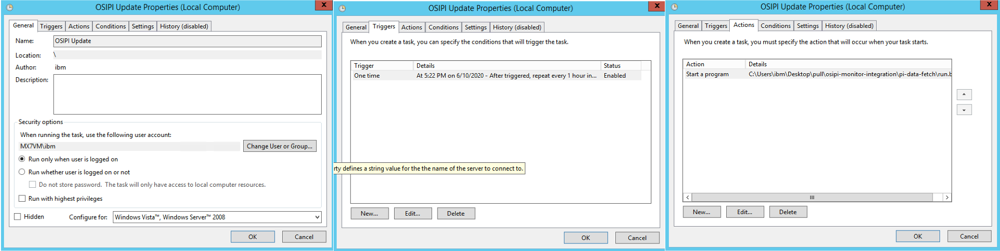  


### 8. *View oil well down time data in Maximo Asset Monitor*  

* Login to your instance of Maximo Asset Monitor and click on the Monitor tab. Here you can see all of the entity types created.

* Search for your Entity Type "POINTS"

 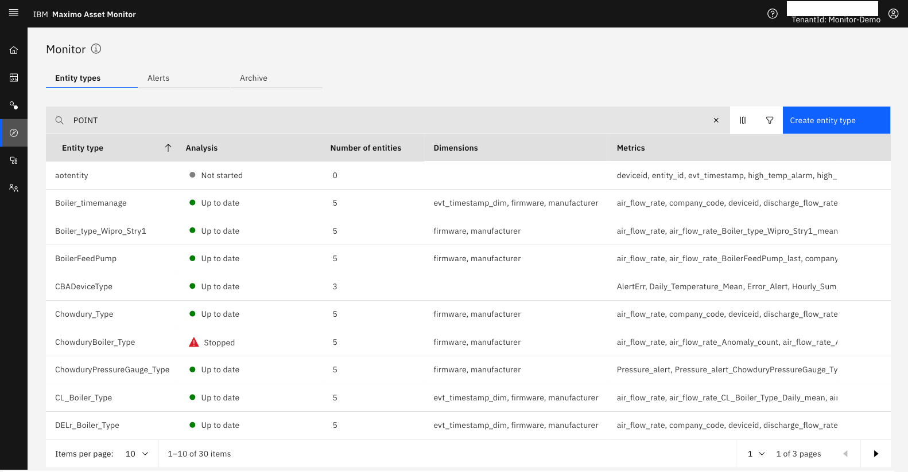  

* Select your Entity Type "POINTS" from your search results. This loads the main dashboard tab which will display a list of dashboards for each entity. These correspond to OSI PI asset attributes or points, each containing the dimension and time series data that was sent to Maximo Asset Monitor from the Web API REST client through App Connect.

 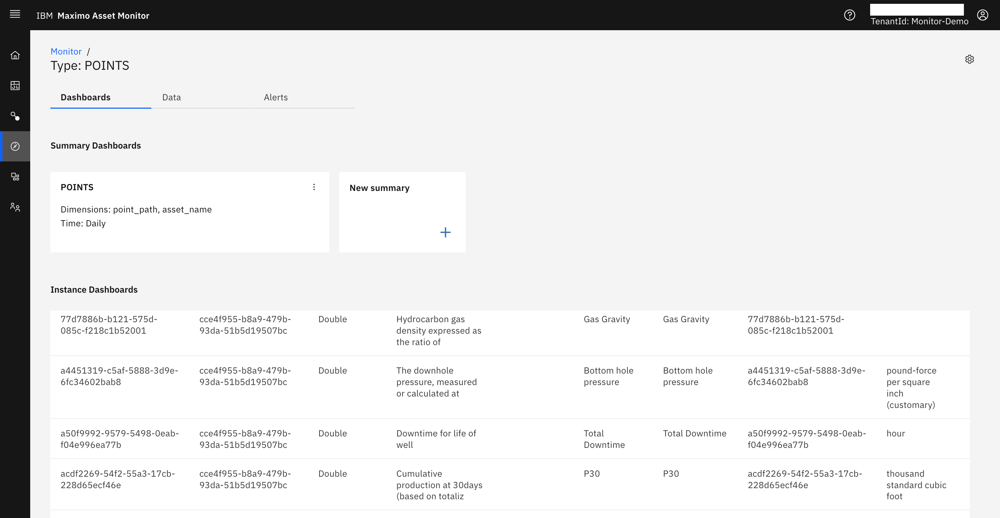  

* Click on any point and which launches a dashboard view for that point and observe the dimensions and metrics. On the metrics tab is a widget that displays time series data for the data point that was sent from the OSI PI data historian and is updated every hour depending on the schedule of the client script.

 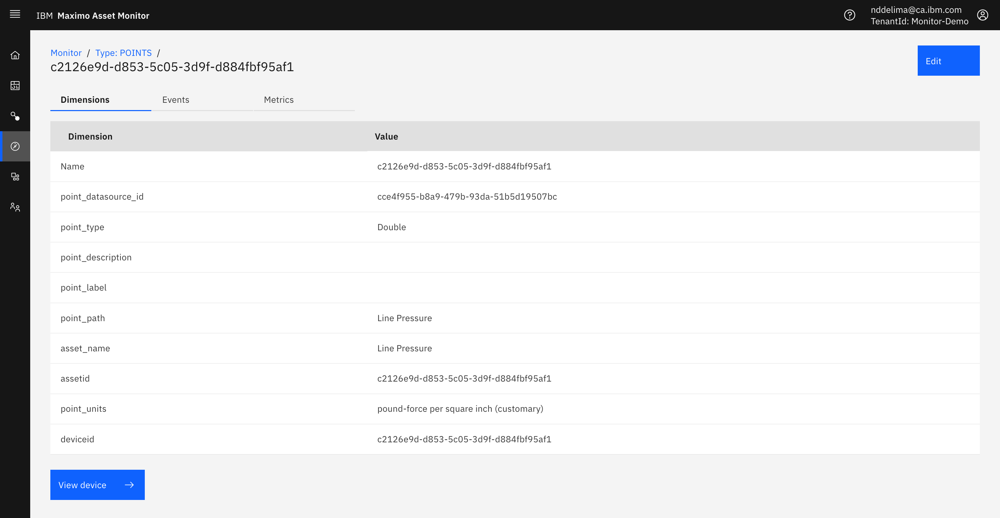  

 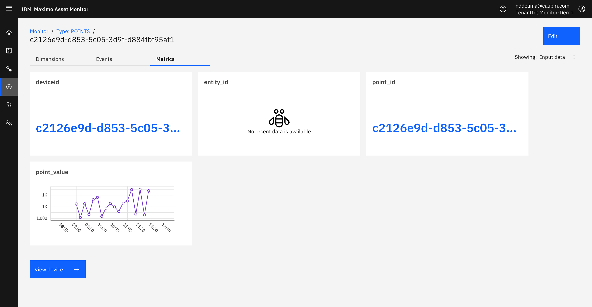  

* Click on the data tab in the main dashboard view. This launches views to display, Metrics, Calculated Metrics and Dimension data for the POINTS Entity Type.

 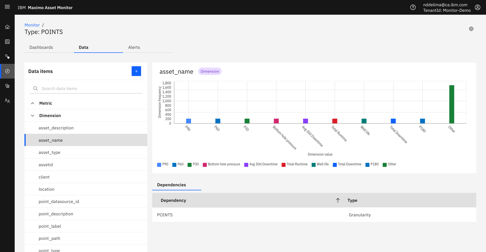  


### 9. *Create and view dashboard to monitor Oil Well operations in Maximo Asset Monitor*

* Create an instance dashboard by importing the dashboard template json in `./maximo-asset-monitor/dashboards`
<!-- *Add screen shot* -->

* Create a new Summary Dashboard by importing the dashboard template json in `./maximo-asset-monitor/dashboards`


<!-- keep this -->
## License

This code pattern is licensed under the Apache License, Version 2. Separate third-party code objects invoked within this code pattern are licensed by their respective providers pursuant to their own separate licenses. Contributions are subject to the [Developer Certificate of Origin, Version 1.1](https://developercertificate.org/) and the [Apache License, Version 2](https://www.apache.org/licenses/LICENSE-2.0.txt).

[Apache License FAQ](https://www.apache.org/foundation/license-faq.html#WhatDoesItMEAN)
